# UX Design Specification - sheduleApp

**Author:** PooMO
**Date:** 2026-01-14

---

## Executive Summary

### Project Vision

sheduleApp is a modern, non-bloated scheduling platform for multi-provider wellness businesses. It solves the chaos of double-bookings, no-shows, and fragmented booking experiences through intelligent 4-layer availability filtering and seamless Google Calendar integration.

**Design Philosophy:** Calm, efficient, and delightful. Every interaction should feel effortless while hiding the complexity underneath.

### Target Users

| Persona | Context | Primary Goal | Device |
|---------|---------|--------------|--------|
| 🧘 **Priya (Client)** | 32, busy marketing manager, stressed | Book wellness sessions quickly without phone calls | Mobile-first Web (PWA) |
| 🧘‍♂️ **Ravi (Provider)** | Meditation guru, values clarity | Know the day's schedule with zero surprises | Mobile-first Web (PWA) |
| 👩‍💼 **Anita (Admin)** | Center manager, efficiency-focused | Manage services, providers, and bookings effortlessly | Mobile-first Web (Tablet-optimized) |

### Key Design Challenges

| Challenge | UX Impact |
|-----------|-----------|
| **Complex Availability Logic** | Must feel instant and simple to clients despite 4-layer computation |
| **Pay Later Approval Flow** | Admin needs clear pending queue without cognitive overload |
| **Provider Scheduling UI** | Recurring slots + exception overrides needs intuitive visual design |
| **Modular Interface** | Consultations vs Classes modules need cohesive yet separate UX |
| **Registration Friction** | Mandatory signup must feel quick, not burdensome |

### Design Opportunities

| Opportunity | Competitive Advantage |
|-------------|----------------------|
| **Zero-Friction Booking** | Client books in < 2 minutes, feels like "that was easy" |
| **Calm Calendar UX** | Provider dashboard that "just works" like a serene morning |
| **Admin Confidence** | Approval workflows that prevent mistakes and feel empowering |
| **Premium Non-Bloated Feel** | Clean design = competitive differentiator vs clunky alternatives |

---

## Core User Experience

### Defining Experience

| Persona | Core Action | "Nailed It" Moment |
|---------|-------------|-------------------|
| **Priya (Client)** | Find available slot & book | Confirmation in < 2 minutes |
| **Ravi (Provider)** | Check today's schedule | Glance at dashboard, know everything |
| **Anita (Admin)** | Set up availability & approve bookings | Zero confusion, zero double-booking |


### Platform Strategy

| Platform | Type | Key Considerations |
|----------|------|-------------------|
| **Client (MVP)** | Embeddable Widget | Iframe-based, works on any website, responsive |
| **Client (Phase 2)** | Mobile-first Web (PWA) | Standalone discovery + booking portal |
| **Provider** | Mobile-first Web (PWA) | Responsive dashboard, calendar views |
| **Admin** | Mobile-first Web (Tablet-optimized) | Complex forms, approval workflows, widget configurator |

> **STRATEGIC UPDATE (2026-01-18):** MVP focuses on embeddable booking widgets for client-facing interface. Standalone discovery UI deferred to Phase 2. All roles access via a single unified Next.js web application.

**Design Constraint:** Mobile-first patterns for all roles. Embed widget must work seamlessly inside iframes on external websites.

### Effortless Interactions

| Interaction | What Makes It Effortless |
|-------------|-------------------------|
| **Slot Selection** | Calendar shows ONLY bookable slots (no red X's everywhere) |
| **Registration** | 3 fields max (email, mobile, password), then done |
| **Day View (Provider)** | One glance = full picture (timeline, not list) |
| **Availability Setup** | Visual drag-to-set blocks, not form fields |
| **Pay Later Approval** | Swipe to approve, one button action |

### Critical Success Moments

| Moment | What Must Happen |
|--------|------------------|
| **First Booking** | Client thinks "that was easy" |
| **Provider Morning** | Provider opens app and feels calm, not anxious |
| **Admin Onboarding** | New service + provider set up in < 5 minutes |
| **Pay Later Flow** | Admin confident they won't miss pending bookings |

### Experience Principles

1. **Calm Over Clutter** — Every screen should feel peaceful, not overwhelming
2. **Show Only What Matters** — Hide complexity; surface only actionable items
3. **Touch-First, Type-Second** — Prefer taps/swipes over typing wherever possible
4. **Confidence Through Feedback** — Users always know what happened and what's next
5. **Instant Gratification** — Core actions complete in < 3 seconds

---

## Desired Emotional Response

### Primary Emotional Goals

| Persona | What They Should Feel | Why It Matters |
|---------|----------------------|----------------|
| **Priya (Client)** | Relief + Accomplishment | "That was so easy, I actually want to book again" |
| **Ravi (Provider)** | Calm + Control | "I know exactly what's happening today, no surprises" |
| **Anita (Admin)** | Confidence + Empowerment | "I've got this under control, nothing slips through" |

### Emotional Journey Mapping

| Stage | Desired Emotion | Design Implication |
|-------|-----------------|-------------------|
| **First Discovery** | Curious + Intrigued | Clean landing page, clear value proposition |
| **During Booking** | Focused + Flowing | No distractions, smooth progression |
| **After Confirmation** | Relieved + Happy | Celebratory confirmation animation |
| **When Error Occurs** | Reassured + Guided | Friendly error messages, clear next steps |
| **Return Visit** | Familiar + Efficient | Remembered preferences, quick re-booking |

### Micro-Emotions to Address

| Emotion Pair | Design Response |
|--------------|-----------------|
| **Confidence vs Confusion** | Clear labels, obvious next actions, progress indicators |
| **Trust vs Skepticism** | Transparent availability, no hidden fees |
| **Calm vs Anxiety** | Clean UI, ample white space, no visual noise |
| **Accomplishment vs Frustration** | Fast confirmations, success celebrations |

### Emotions to Avoid

| Negative Emotion | How We Prevent It |
|------------------|-------------------|
| **Overwhelm** | Limited choices per screen, progressive disclosure |
| **Uncertainty** | Always show booking status, confirmation at every step |
| **Anxiety** | No pressure tactics, clear cancellation policies |
| **Frustration** | Fast load times, no dead ends, graceful error handling |

### Emotional Design Principles

1. **Calm is Luxury** — White space and restraint feel more premium than feature-packed screens
2. **Celebrate Success** — Every completed action deserves acknowledgment (✓ animation, not just text)
3. **Fail Gracefully** — Errors feel like the system is "helping you try again" not "blocking you"
4. **Anticipate Needs** — Show what users need next before they have to ask
5. **Build Trust Slowly** — Each smooth interaction earns trust for the next

---

## UX Pattern Analysis & Inspiration

### Inspiring Products Analysis

| App | What They Do Well | Transferable Pattern |
|-----|-------------------|---------------------|
| **Calendly** | Clean slot picker, zero-friction booking | Time slot selection UI |
| **Headspace** | Calm aesthetic, wellness vibe, onboarding | Visual tone, breathing room |
| **Apple Calendar** | Simple day/month views, clean timeline | Provider dashboard calendar |
| **Stripe Dashboard** | Clear pending items, action-oriented | Admin approval queue |
| **WhatsApp** | Swipe actions, quick conversations | Swipe-to-approve gesture |

### Transferable UX Patterns

#### Navigation Patterns
| Pattern | From | Apply To |
|---------|------|----------|
| **Bottom Tab Navigation** | Most modern apps | Client Web App (Services, Bookings, Profile) |
| **Floating Action Button** | Material Design | Quick booking action |
| **Pull-to-Refresh** | Standard mobile | Refresh schedules |

#### Interaction Patterns
| Pattern | From | Apply To |
|---------|------|----------|
| **Slot Selection Grid** | Calendly | Booking calendar |
| **Timeline View** | Apple Calendar | Provider day view |
| **Swipe Actions** | Email apps | Admin queue management |
| **Progressive Disclosure** | iOS Settings | Availability setup |

#### Visual Patterns
| Pattern | From | Apply To |
|---------|------|----------|
| **Ample White Space** | Headspace | All screens (calm) |
| **Soft Gradients** | Modern wellness apps | Primary buttons |
| **Success Animations** | Duolingo, Apple | Booking confirmation |

### Anti-Patterns to Avoid

| Anti-Pattern | Why We Avoid It |
|--------------|-----------------|
| **Red "Unavailable" Slots Everywhere** | Creates anxiety; show only available |
| **Long Registration Forms** | Friction kills conversion |
| **Desktop-First Calendar Pickers** | Clunky on mobile |
| **Pop-up Interruptions** | Breaks "calm" principle |
| **Confirmation Modal After Modal** | Frustrating; one clear action per flow |

### Design Inspiration Strategy

| Action | Pattern | Because |
|--------|---------|---------|
| **ADOPT** | Calendly slot picker | Proven, familiar, efficient |
| **ADOPT** | Bottom navigation | Mobile-first standard |
| **ADAPT** | Timeline day view | Simplify for read-only providers |
| **ADAPT** | Headspace aesthetics | Wellness vibe, but more functional |
| **AVOID** | Dense data tables | Admin mobile needs larger touch targets |

---

## Design System Foundation

### Tech Stack Decision

> **STRATEGIC UPDATE (2026-01-15):** Unified Next.js web application for all user roles.

| User Type | Platform | Tech Stack |
|-----------|----------|------------|
| **Client** | Web (Mobile-first + Desktop) | Next.js + TailwindCSS + FullCalendar |
| **Provider** | Web (Mobile-first + Desktop) | Next.js + TailwindCSS + FullCalendar |
| **Admin** | Web (Tablet-optimized + Desktop) | Next.js + TailwindCSS + FullCalendar |

**Codebases:** 1 (Next.js Monorepo) → All platforms covered via responsive design

### Rationale for Selection

| Factor | Why This Stack |
|--------|---------------|
| **Calendar Ecosystem** | React has mature calendar libraries (FullCalendar) |
| **AI Agent Support** | React/Next.js has largest training data, excellent AI code generation |
| **Solo Development** | Single codebase reduces complexity; TailwindCSS enables rapid styling |
| **Cross-Platform** | Responsive design serves mobile + desktop from one codebase |
| **Minimalist Design** | TailwindCSS enables clean, consistent styling with utility classes |

### Design Tokens

| Token | Value |
|-------|-------|
| **Primary Color** | Calm teal (#0D9488 or similar) |
| **Secondary Color** | Soft neutral gray |
| **Success Color** | Soft green (#10B981) |
| **Error Color** | Muted red (#EF4444) |
| **Font Family** | Inter (Google Fonts) |
| **Base Spacing** | 8px scale (generous, calm) |
| **Border Radius** | 12px (cards), 8px (buttons), 9999px (pills) |

### Component Strategy

| Component Type | Approach |
|---------------|----------|
| **Primitive Components** | Headless UI + TailwindCSS |
| **Calendar Components** | FullCalendar with custom styling |
| **Forms** | React Hook Form + custom styled inputs |
| **Icons** | Heroicons |
| **Animations** | Framer Motion |

---

## Core User Experience

### Defining Experience

| User | Defining Experience |
|------|---------------------|
| **Priya (Client)** | "I see only times that actually work, pick one, done." |
| **Ravi (Provider)** | "I open the app, I see my day, no confusion." |
| **Anita (Admin)** | "I set it up once, it just runs itself." |

**Core Promise:** Complexity is hidden; simplicity is visible.

### User Mental Model

| User | How They Think About It |
|------|------------------------|
| **Client** | "Like booking a restaurant but easier" |
| **Provider** | "My personal assistant tells me who's coming" |
| **Admin** | "I'm the air traffic controller, but the system does the work" |

### Success Criteria

| Criteria | Measurement |
|----------|-------------|
| **Booking feels instant** | < 2 minutes from open to confirmed |
| **No wasted taps** | Max 4 taps to complete booking |
| **Zero confusion** | User never asks "what do I do now?" |
| **Smart defaults** | System suggests best options first |
| **Celebration at end** | Clear success animation + email |

### Experience Mechanics (Client Booking Flow)

| Stage | What Happens |
|-------|-------------|
| **1. Initiation** | Client opens app → Services grid (large, tappable) |
| **2. Selection** | Tap service → Provider options (if multiple) → Calendar |
| **3. Slot Choice** | Only green/available slots shown → Tap to select |
| **4. Confirmation** | Summary card + Pay/Pay Later → One button confirm |
| **5. Success** | Check animation + "See you on [date]!" + Email sent |

### Novel UX Patterns

| Pattern | What's Different |
|---------|-----------------|
| **4-Layer Hidden Complexity** | User sees simplicity; system does 4-layer check silently |
| **No Red Unavailable Slots** | Other apps show what's blocked; we only show what's open |
| **Pay Later Trust Flow** | Instead of credit hold, we use admin approval (humane) |

---

## Visual Design Foundation

### Color System

| Role | Color | Hex | Usage |
|------|-------|-----|-------|
| **Primary** | Calm Teal | `#0D9488` | Buttons, links, active states |
| **Primary Light** | Soft Teal | `#5EEAD4` | Hover states, backgrounds |
| **Secondary** | Cool Gray | `#64748B` | Secondary text, icons |
| **Success** | Soft Green | `#10B981` | Confirmed, available slots |
| **Warning** | Warm Amber | `#F59E0B` | Pending states, alerts |
| **Error** | Muted Red | `#EF4444` | Errors (used sparingly) |
| **Background** | Off-White | `#F8FAFC` | Page backgrounds |
| **Surface** | Pure White | `#FFFFFF` | Cards, modals |
| **Text Primary** | Dark Slate | `#1E293B` | Headlines |
| **Text Secondary** | Slate | `#64748B` | Body text |

### Typography System

| Element | Font | Size | Weight |
|---------|------|------|--------|
| **Font Family** | Inter | — | — |
| **H1** | Inter | 32px | 700 (Bold) |
| **H2** | Inter | 24px | 600 (Semi) |
| **H3** | Inter | 18px | 600 (Semi) |
| **Body** | Inter | 16px | 400 (Regular) |
| **Small** | Inter | 14px | 400 (Regular) |
| **Caption** | Inter | 12px | 500 (Medium) |

### Spacing & Layout Foundation

| Token | Value | Usage |
|-------|-------|-------|
| **Base Unit** | 8px | All spacing in multiples of 8 |
| **xs** | 4px | Tight spacing |
| **sm** | 8px | Component internal |
| **md** | 16px | Between elements |
| **lg** | 24px | Section separation |
| **xl** | 32px | Major sections |
| **2xl** | 48px | Page margins |

**Layout Principle:** Generous white space = calm, premium feel

### Accessibility Considerations

| Standard | Target |
|----------|--------|
| **Color Contrast** | WCAG AA (4.5:1 minimum) |
| **Touch Target** | 44x44px minimum |
| **Font Size Minimum** | 14px (readable on mobile) |
| **Focus States** | Visible focus rings for keyboard nav |

---

## Design Direction Decision

### Chosen Direction: B — Minimal & List-Based (Calendly-inspired)

| Element | Description |
|---------|-------------|
| **Layout** | Clean list view, compact service rows |
| **Calendar** | Inline week strip, scrollable day view |
| **Navigation** | Bottom tabs with subtle icons |
| **Vibe** | Ultra-clean, Calendly-inspired, efficient |

### Design Rationale

| Reason | Alignment |
|--------|-----------|
| Fastest path to booking | Matches "< 2 min" goal |
| Least visual noise | Matches "Calm" principle |
| Works on all devices | Mobile-first but scales |
| Calendly-proven pattern | Reduces learning curve |

### SaaS Theming Strategy

| Business Type | Theme Preset |
|---------------|--------------|
| **Professional Services** | Minimal, clean, corporate |
| **Wellness** (yoga, meditation) | Calm teal, soft gradients |
| **Salons & Beauty** | Vibrant, card-based with photos |
| **Gyms & Fitness** | Bold colors, energetic imagery |
| **Medical** | Clinical, trust-focused blue |

**MVP:** Default to Direction B (Calendly-style)
**Phase 2:** Add theme presets for different business types
**Phase 3:** White-label full customization

### Implementation Approach

- Core UX patterns remain consistent across all themes
- Only colors, fonts, and image usage change per theme
- TailwindCSS theme tokens enable easy switching
- React Native theming via NativeWind context

---

## User Journey Flows

> All journeys verified against PRD Functional Requirements (FR1-FR60)

### Journey Coverage Matrix

| Journey | User | FRs Covered |
|---------|------|-------------|
| J1 | Client | FR1-8, FR10-14, FR16, FR22-26 |
| J2 | Client | FR1-4, FR9, FR10-14, FR17, FR22-26 |
| J3 | Provider | FR38-42 |
| J4a | Admin | FR43, FR44, FR46 (Consultations Module) |
| J4b | Admin | FR43, FR44, FR45, FR46 (Classes Module) |
| J5 | Admin | FR28-32 |
| J6 | Admin | FR47-50, FR60 |
| J7 | Client | FR18, FR27 |
| J8 | Client | FR19-21 |
| J9 | Admin | FR51-54 |

---

### J1: Client Books a 1:1 Consultation

```mermaid
flowchart TD
    A[Open App] --> B[Consultations Module]
    B --> C[Services List]
    C --> D[Tap Service]
    D --> E{Multiple Providers?}
    E -->|Yes| F[Select Provider]
    E -->|No| G[Calendar View]
    F --> G
    G --> H[Week Strip + Day Slots]
    H --> I[Tap Available Slot]
    I --> J{Logged In?}
    J -->|No| K[Quick Register]
    J -->|Yes| L[Booking Summary]
    K --> L
    L --> M{Payment Option}
    M -->|Pay Now| N[PayHere Checkout]
    M -->|Pay Later| O[Booking Pending]
    N --> P[✅ Confirmed + Email]
    O --> Q[⏳ Awaiting Admin Approval]
```



### J2: Client Books a Group Class

```mermaid
flowchart TD
    A[Open App] --> B[Classes Module]
    B --> C[List of Group Classes]
    C --> D[Tap Class]
    D --> E[Class Details + Capacity Shown]
    E --> F{Spots Available?}
    F -->|Yes| G[View Schedule]
    F -->|No| H[Show Full Message]
    G --> I[Select Date/Time]
    I --> J{Logged In?}
    J -->|No| K[Quick Register]
    J -->|Yes| L[Booking Summary]
    K --> L
    L --> M{Payment}
    M -->|Pay Now| N[PayHere]
    M -->|Pay Later| O[Pending]
    N --> P[✅ Confirmed + Capacity -1]
    O --> Q[⏳ Awaiting Approval]
```



### J3: Provider Checks Today's Schedule


### J4a: Admin Adds a Consultation (Consultations Module)

```mermaid
flowchart TD
    A[Open Admin App] --> B[Consultations Module]
    B --> C[+ Add Consultation]
    C --> D[Enter Name, Description]
    D --> E[Set Duration & Price]
    E --> F[Assign Providers from Shared List]
    F --> G[Review & Save]
    G --> H[✅ Consultation Created]
```



### J4b: Admin Adds a Class (Classes Module)

```mermaid
flowchart TD
    A[Open Admin App] --> B[Classes Module]
    B --> C[+ Add Class]
    C --> D[Enter Name, Description]
    D --> E[Set Duration & Price]
    E --> F[Set Max Capacity]
    F --> G[Assign Providers from Shared List]
    G --> H[Set Recurring Schedule]
    H --> I[Review & Save]
    I --> J[✅ Class Created]
```



### J5: Admin Approves Pay Later Booking


### J6: Admin Adds a Provider (Shared)

```mermaid
flowchart TD
    A[Open Admin App] --> B[Providers Tab]
    B --> C[+ Add Provider]
    C --> D[Enter Name, Email, Phone]
    D --> E[Upload Photo]
    E --> F[Set Bio/Description]
    F --> G[Set Recurring Availability]
    G --> H{Link Google Calendar?}
    H -->|Yes| I[OAuth Flow]
    H -->|Skip| J[Continue]
    I --> K[Calendar Synced]
    J --> L[Review & Save]
    K --> L
    L --> M[✅ Provider Created]
    M --> N[Available in Both Modules]
```



### J7: Client Sets Up Recurring Appointment

```mermaid
flowchart TD
    A[Complete First Booking] --> B[See Make Recurring Prompt]
    B --> C{Yes/No}
    C -->|Yes| D[Select Frequency]
    D --> E[Weekly / Biweekly / Monthly]
    E --> F[Select End Date or Number]
    F --> G[Review Recurring Schedule]
    G --> H{Payment?}
    H -->|Pay All Now| I[PayHere - Full Amount]
    H -->|Pay Per Session| J[Setup Recurring Payment]
    I --> K[✅ All Sessions Confirmed]
    J --> L[✅ First Confirmed + Autopay]
```



### J8: Client Reschedules/Cancels Booking

```mermaid
flowchart TD
    A[Open My Bookings] --> B[List of Upcoming Bookings]
    B --> C[Tap Booking]
    C --> D[Booking Details]
    D --> E{Action}
    E -->|Reschedule| F[Calendar View]
    F --> G[Select New Slot]
    G --> H[Confirm Reschedule]
    H --> I[✅ Rescheduled + Emails Sent]
    E -->|Cancel| J[Confirm Cancel?]
    J --> K[Optional: Reason]
    K --> L[✅ Cancelled + Refund Policy]
```



### J9: Admin Views Bookings & Reports

```mermaid
flowchart TD
    A[Open Admin App] --> B[Bookings Tab]
    B --> C[Filter: All / Pending / Confirmed / Cancelled]
    C --> D[List of Bookings]
    D --> E{Tap Booking}
    E --> F[Booking Details]
    F --> G[Actions: Reschedule / Cancel / Contact]
    B --> H[Reports Sub-Tab]
    H --> I[Date Range Selector]
    I --> J[View: Bookings Count, Revenue, Cancellations]

### J10: Admin Impersonates Provider (New)

```mermaid
flowchart TD
    A[Admin Dashboard] --> B[Providers Tab]
    B --> C[List of Providers]
    C --> D[Click 'Ravi']
    D --> E[Provider Dashboard View (Mocked)]
    E --> F{Select Tab}
    F -->|Appointments| G[View Ravi's Appointments]
    F -->|Schedule| H[View/Edit Ravi's Availability]
    F -->|Clients| I[View Ravi's Client List]
    I --> J[Click Client Name]
    J --> K[Client Detail Card]
    K --> L{Check Notes}
    L -->|Private Note| M[HIDDEN 🚫]
    L -->|Public Info| N[Visible ✅]
```

### J11: Responsive Admin Shell Navigation

```mermaid
flowchart TD
    A[Open Admin Page] --> B{Screen Size?}
    B -->|Desktop >1024px| C[Sidebar Expanded]
    B -->|Mobile <768px| D[Hamburger Menu]
    C --> E{Click Team Member}
    E --> F[Slide-over Pane (Right)]
    F --> G[List remains visible (Left)]
    D --> H{Click Team Member}
    H --> I[Full Screen Push]
    I --> J[List Hidden]
    I --> K[See 'Back' Button]
    K --> L[Return to List]
```
```

---

### Flow Optimization Principles

| Principle | Implementation |
|-----------|----------------|
| **Minimize Taps** | Max 4 taps to complete core action |
| **Show Progress** | Progress indicator during multi-step flows |
| **Smart Defaults** | Pre-select first available provider |
| **Clear Feedback** | Loading states, success animations |
| **Error Recovery** | "Try again" with single tap |

---

## Component Strategy

### Design System Coverage

| Component | Source | Available? |
|-----------|--------|------------|
| **Buttons** | Custom with TailwindCSS | ✅ Build |
| **Inputs** | Custom with TailwindCSS | ✅ Build |
| **Modals** | Headless UI | ✅ Available |
| **Dropdowns** | Headless UI | ✅ Available |
| **Tabs** | Headless UI | ✅ Available |
| **Icons** | Heroicons | ✅ Available |
| **Calendar** | FullCalendar | ✅ Available |
| **Forms** | React Hook Form | ✅ Available |

### Custom Components

| Component | Purpose | Used In |
|-----------|---------|---------|
| **ServiceCard** | Display consultation/class with name, duration, price | J1, J2 |
| **ProviderCard** | Provider selection with photo, name, availability | J1, J6 |
| **TimeSlotGrid** | Available time slots as tappable buttons | J1, J2 |
| **BookingSummary** | Confirmation preview before payment | J1, J2 |
| **AppointmentCard** | Provider's schedule item with client details | J3 |
| **PendingApprovalCard** | Admin approval queue item with swipe actions | J5 |
| **AvailabilityBlock** | Visual drag-to-set availability editor | J6 |
| **StatsCard** | Dashboard metrics display | J9 |

### Implementation Roadmap

| Phase | Components | Priority |
|-------|------------|----------|
| **Phase 1: MVP** | ServiceCard, TimeSlotGrid, BookingSummary | Critical path |
| **Phase 2: Core** | ProviderCard, AppointmentCard, PendingApprovalCard | Core journeys |
| **Phase 3: Admin** | AvailabilityBlock, StatsCard | Enhancement |

### Component Specifications

All custom components will:
- Use design tokens from Visual Foundation (colors, spacing, typography)
- Support dark mode via TailwindCSS dark: classes
- Meet WCAG AA accessibility standards
- Include loading, error, and empty states
- Be fully responsive across mobile, tablet, and desktop breakpoints

---

## UX Consistency Patterns

### Button Hierarchy

| Type | Usage | Style |
|------|-------|-------|
| **Primary** | Main action (Book, Confirm, Save) | Filled teal, full width on mobile |
| **Secondary** | Alternative action (Cancel, Back) | Outline teal |
| **Tertiary** | Low-priority (Skip, Later) | Text-only, subtle |
| **Destructive** | Delete, Cancel booking | Red fill or outline |

### Feedback Patterns

| State | Visual | Behavior |
|-------|--------|----------|
| **Success** | Green toast + ✓ animation | Auto-dismiss after 3s |
| **Error** | Red toast + shake animation | Stays until dismissed |
| **Warning** | Amber toast | Auto-dismiss after 5s |
| **Loading** | Skeleton + spinner | Block interaction |

### Form Patterns

| Element | Behavior |
|---------|----------|
| **Input Focus** | Teal border + label lift |
| **Validation** | Inline error below field (red text) |
| **Required Fields** | Asterisk (*) + error on blur |
| **Submit** | Disable button until valid |

### Navigation Patterns

| Pattern | Usage |
|---------|-------|
| **Bottom Tabs** | Client: Services, Bookings, Profile |
| **Bottom Tabs** | Admin: Providers, Consultations, Classes, Bookings |
| **Back Arrow** | Top-left, always available |
| **Pull to Refresh** | All list views |

### Empty & Loading States

| State | Pattern |
|-------|---------|
| **Empty List** | Friendly illustration + "No items yet" + CTA |
| **Loading** | Skeleton placeholders (not spinners) |
| **Error** | "Oops!" + Retry button |

---

## Responsive Design & Accessibility

### Responsive Strategy

> **STRATEGIC UPDATE (2026-01-15):** All roles served by unified Next.js web application.

| Platform | Strategy |
|----------|----------|
| **Client Web (PWA)** | Mobile-first, scales up to tablet/desktop |
| **Provider Web (PWA)** | Mobile-first dashboard, scales to desktop |
| **Admin Web** | Tablet-optimized, scales to desktop |

### Breakpoint Strategy

| Breakpoint | Width | Layout Changes |
|------------|-------|----------------|
| **Mobile** | < 640px | Single column, bottom nav, full-width buttons |
| **Tablet** | 640-1024px | Two-column options, larger touch targets |
| **Desktop** | > 1024px | Side navigation, multi-panel layouts |

**Approach:** Mobile-first (TailwindCSS default)

### Accessibility Strategy

| Standard | Target |
|----------|--------|
| **WCAG Level** | AA compliance (industry standard) |
| **Color Contrast** | 4.5:1 minimum for text |
| **Touch Targets** | 44x44px minimum |
| **Focus Indicators** | Visible teal outline ring |
| **Screen Reader** | Full VoiceOver/TalkBack support |
| **Keyboard Navigation** | Tab order, skip links |

### Testing Strategy

| Test Type | Tools/Approach |
|-----------|----------------|
| **Responsive** | Chrome DevTools, actual devices |
| **Accessibility** | axe DevTools, Lighthouse, manual |
| **Screen Reader** | VoiceOver (iOS/Mac), TalkBack (Android) |
| **Color Blindness** | Chrome DevTools simulation |

### Implementation Guidelines

| Guideline | Application |
|-----------|-------------|
| **Use rem/em** | All font sizes and spacing |
| **Mobile-first media queries** | `sm:`, `md:`, `lg:` in Tailwind |
| **Semantic HTML** | Proper heading hierarchy, landmarks |
| **ARIA labels** | All interactive elements |
| **Alt text** | All images |

---

## Document Status

| Field | Value |
|-------|-------|
| **Status** | ✅ Complete (Revised) |
| **Completed** | 2026-01-15 |
| **Steps Completed** | 14/14 |
| **Revision Note** | Updated for unified Next.js web strategy |
| **Ready For** | Architecture Definition |
